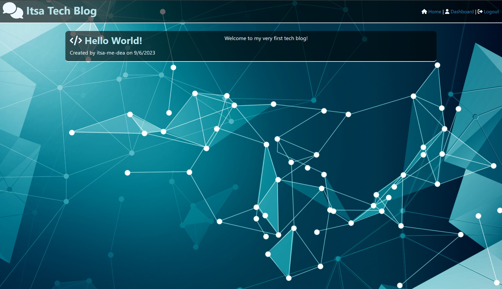
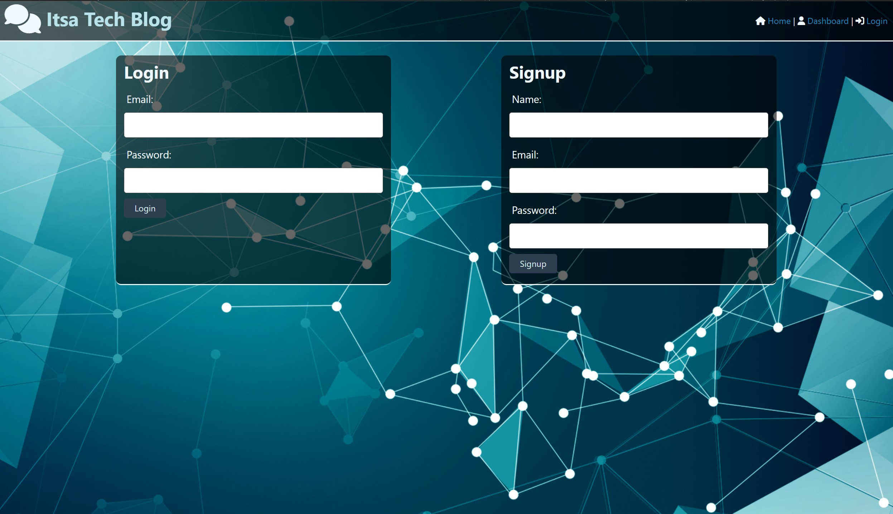
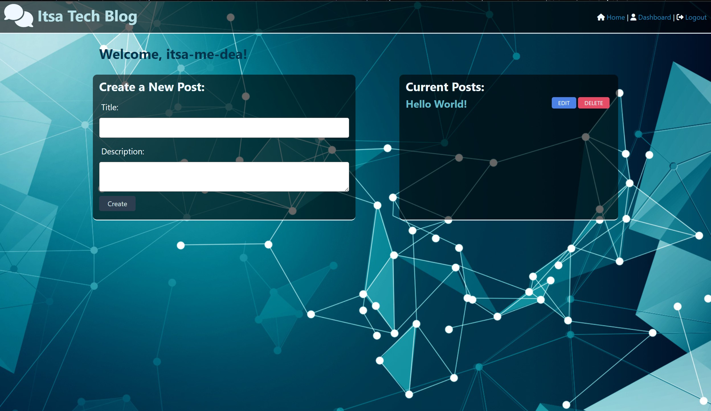
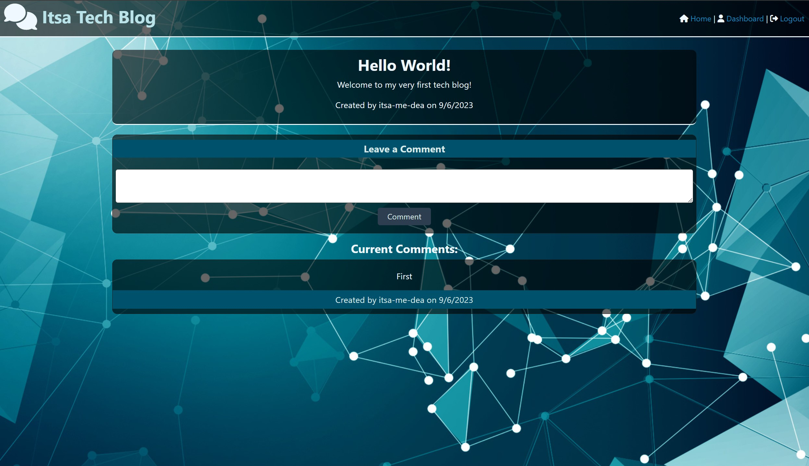

# Itsa Tech Blog

[](https://mit-license.org/)
[](https://www.contributor-covenant.org/version/2/1/code_of_conduct/)

### **[Description](#description) | [Installation](#installation) | [Usage](#usage) | [Credits](#credits) | [License](#license) | [Contribute](#contribute) | [Questions](#questions)**

## Description

My goal was to build a tech blog that runs in the browser and utilizes model–view–controllers (MVCs) specifcally Handlebars.js as the templating language, Sequelize as the object-relational mapping (ORM), and the express-session npm package for authentication. My motivation was to create a blog, where developers can publish their blog posts and comment on other developers’ posts.

I learned a great deal on how work with handlebars, sequalize, and middleware management.

## Installation

Deployed site (installation not needed): https://itsa-tech-blog-687ff7858ff3.herokuapp.com/

-OR-

Forking from Repo:
1. Fork or download repository
2. Open a terminal with the root directory
3. In the terminal, enter `npm i`
4. Update `.env` with the following (include your password if needed)
    ```
    DB_NAME='techblog_db'
    DB_USER='root'
    DB_PASSWORD=''
    ```
5. Enter `npm run seed`
6. Enter `npm run start`
7. Open http://localhost:3001 in browser

## Usage

You will start on the homepage, where you can navigate the site via the navbar or select a post on the homepage to open.



On the navbar, selecting `Dashboard` or `Login` will prompt you to create an account or login with existing credentials.


Once logged in, you'll have access to your `Dashboard`, where you can create and edit your posts. Additionally, you'll be able to select other posts and add your comments to them.



## Credits

- Collaborators: 
  - N/A.
- Third-party assets: 
  - https://slidesdocs.com/background/light-effect-technology-line-intelligent-tech-simple-powerpoint-background_b4f31c1620
  - https://fontawesome.com/
  - https://sequelize.org/
  - https://dev.mysql.com/
  - https://www.npmjs.com/package/dotenv
  - https://www.npmjs.com/package/express
  - https://www.npmjs.com/package/express-handlebars
  - https://www.npmjs.com/package/express-session
- Tutorials: 
  - UCSD-VIRT-FSF-PT-03-2023-U-LOLC
  - https://stackoverflow.com/questions/8158244/how-to-update-a-record-using-sequelize-for-node
  - https://www.geeksforgeeks.org/express-js-res-render-function/#
  - https://bobbyhadz.com/blog/typeerror-router-use-required-middleware-function-but-got-an-object
  - https://stackoverflow.com/questions/27465850/typeerror-router-use-requires-middleware-function-but-got-a-object
  - https://stackoverflow.com/questions/31591020/onclick-function-on-elements-in-handlebars-template
  - https://stackoverflow.com/questions/63028838/post-http-localhost3000-data-400-bad-request-when-trying-to-send-data-from

## License

 The license this application is covered under is: [MIT License](https://mit-license.org/).

## Contribute

In general, follow the "fork-and-pull" Git workflow.

  1. **Fork** the repo on GitHub.
  2. **Clone** the project to your own machine.
  3. **Commit** changes to your own branch.
  4. **Push** your work back up to your fork.
  5. Submit a **pull request** so that your changes can be reviewed.
    
  NOTE: Be sure to merge the latest from "upstream" before making a pull request!
  
  When contributing to this project, please follow the [Contributor Covenant](https://www.contributor-covenant.org/version/2/1/code_of_conduct/) code of conduct.

## Questions

My gitHub username is [itsa-me-dea](https://github.com/itsa-me-dea), and you can contact me at wachadea@gmail.com.
